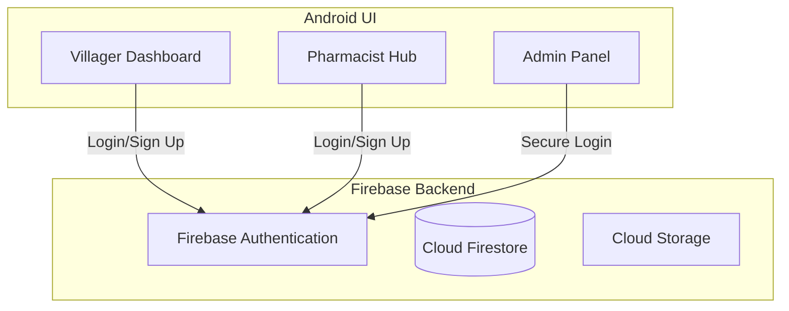

## 📖 About The Project

Grama-Sanjeevini is a dedicated Android application designed to bridge the healthcare gap in rural communities. By connecting local villagers directly with nearby pharmacists, the platform ensures transparency in medicine availability, streamlines inventory management for medical shops, and fosters community trust through a robust feedback system.

### ✨ Key Features

* **👨‍🌾 Villager Access (End-User):** Search for specific medicines, filter pharmacies by location radius (5km/10km), check real-time stock availability, and submit arrangement requests.
* **🏥 Pharmacist Hub (Business User):** Manage medical inventory, quickly update stock statuses (Available/Low/Out of Stock), and accept or process incoming requests.
* **🛡️ Admin Oversight (Superuser):** Verify new pharmacy registrations, manage active shops on the platform, and monitor system logs for security.
* **🤝 Community Trust System:** A two-way, 5-star rating and post-request feedback loop to ensure accountability and reliability.

<br>
## 📱 App Interface

<table>
  <tr>
    <th align="center">Login / Signup</th>
    <th align="center">Villager Search</th>
    <th align="center">Pharmacist Home</th>
  </tr>
  <tr>
    <td align="center"></td>
    <td align="center"></td>
    <td align="center"></td>
  </tr>
</table>

<table>
  <tr>
    <th align="center">Pharmacist Inventory</th>
    <th align="center">Admin Dashboard</th>
  </tr>
  <tr>
    <td align="center"></td>
    <td align="center"></td>
  </tr>
</table>

<br>
## 🏗️ System Architecture


## 📂 Folder Structure

This project follows a clean architecture approach utilizing **MVVM (Model-View-ViewModel)** and modern **Jetpack Compose** for the UI layer.

```text
app/src/main/
├── manifests/
│   └── AndroidManifest.xml              # App configuration and permissions
└── kotlin/com/mindmatrix/gramasanjeevini/
    ├── auth/                            # Authentication flows (Login/Signup)
    ├── components/                      # Reusable Jetpack Compose UI components
    ├── core/                            # Core utilities
    │   ├── AsyncUiState                 # UI State management (Loading/Success/Error)
    │   ├── NativeLocationProvider.kt    # Location services (5km/10km radius filtering)
    │   └── Validation                   # Input validation logic
    ├── dashboard.ui/                    # Main application screens & ViewModels
    │   ├── DashboardScreens.kt          # Main Compose UI screens
    │   ├── InventoryViewModel.kt        # Pharmacist inventory logic
    │   ├── PharmacistViewModel.kt       # Pharmacist core business logic
    │   ├── VillagerSearchScreen.kt      # Villager medicine search UI
    │   └── VillagerViewModel.kt         # Villager search & request logic
    ├── data/                            # Data & Repository layer
    │   ├── AppModels.kt                 # Data classes (Villager, Pharmacist, Medicine)
    │   ├── InventoryRepository          # Firebase Firestore database operations
    │   └── Models.kt                    # Additional domain models
    ├── di/                              # Dependency Injection setup
    ├── navigation/                      # App routing
    │   ├── GramaSanjeeviniNavGraph.kt   # Compose Navigation Graph
    │   └── Routes                       # Navigation route definitions
    └── ui/                              # App Entry points
        ├── GramaSanjeeviniApplication   # Base application class for setup
        └── MainActivity                 # Single Activity container for Compose UI
    V -->|Read Stock & Send Request| DB
    P -->|Write Inventory & Accept Request| DB
    A -->|Audit Logs & Verify Shops| DB

    P -->|Upload Shop Credentials| Storage
```
## 🚀 Getting Started

Follow these comprehensive instructions to set up, build, and run the Grama-Sanjeevini project on your local development environment.

### Prerequisites

Before you begin, ensure your system meets the following requirements:
* **Android Studio** (Latest stable version, e.g., Iguana or newer recommended)
* **Java Development Kit (JDK) 17** or higher
* **Android SDK** API level 34 (Optimized for modern Jetpack Compose)
* An Android Emulator or physical device running API level 24 (Android 7.0) or higher
* A **Google Firebase** account

### Installation & Setup Steps

**1. Clone the repository:**
Open your terminal or command prompt and run:
```bash
git clone https://github.com/ayushak04/Grama-Sanjeevini.git
```
2. Open the project in Android Studio:

Launch Android Studio.

Select File > Open..., navigate to the cloned Grama-Sanjeevini folder, and click OK.

Allow Gradle to complete its initial download and sync (this may take a few minutes).

3. Configure the Firebase Backend:
This application relies on a real-time backend. You must connect it to your own Firebase instance to authenticate users and fetch medicine data.

Go to the Firebase Console and click Create a project.

Register a new Android app within the project using the exact package name: com.mindmatrix.gramasanjeevini.

Download the generated google-services.json file.

Move this file directly into the app/ directory of your Android Studio project.

Crucial: Enable Backend Services in your Firebase Console:

Authentication: Go to Build > Authentication, and enable the Email/Password sign-in provider.

Firestore Database: Go to Build > Firestore Database, and click Create database (Start in Test Mode for local development).

Cloud Storage: Go to Build > Storage, and click Get Started to allow shop credential uploads.

4. Build and Run:

Click File > Sync Project with Gradle Files to ensure all Firebase dependencies are correctly linked.

Select your target device or emulator from the device dropdown menu.

Click the green Run button (▶️) in the top toolbar or press Shift + F10 to compile and launch the application.
